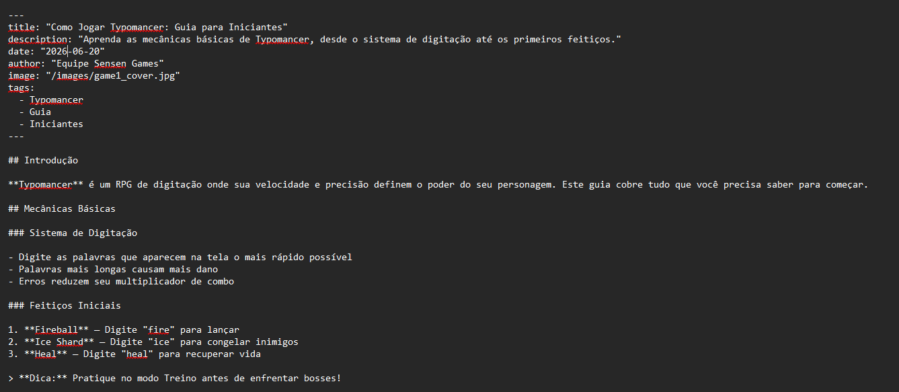

# Guia: Como Criar Páginas com Markdown

Este guia explica como adicionar novas páginas ao site da Sensen Games usando arquivos **Markdown** (`.md`), sem precisar criar arquivos `.tsx`.

---

## Como funciona

O site possui **seções** baseadas em Markdown. Cada seção é uma pasta dentro de `content/` e uma rota no site. Atualmente existem:

| Seção | Pasta de conteúdo | URL base |
|---|---|---|
| Notícias | `content/noticias/` | `/noticias` |
| Guias | `content/guias/` | `/guias` |

Dentro de cada seção, os arquivos são organizados por **idioma**:

```sh
content/
  noticias/
    pt-BR/
      exemplo-noticia.md
    en-US/
      exemplo-noticia.md
  guias/
    pt-BR/
      como-jogar-typomancer.md
    en-US/
      como-jogar-typomancer.md
```

Para adicionar uma nova página, basta criar um arquivo `.md` na pasta de idioma correspondente.

> **Nota sobre o frontmatter:** O início do arquivo `.md` contém um bloco entre `---` (chamado "frontmatter") com metadados como título, descrição e data. Se você não estiver vendo esse bloco no VSCode, certifique-se de que abriu o arquivo correto na pasta `content/` do projeto (não um arquivo do próprio VSCode).



---

## Passo a passo

### 1. Escolher a seção

Decida se o conteúdo é uma **notícia** (`content/noticias/`) ou um **guia** (`content/guias/`).

### 2. Criar o arquivo

Dentro da pasta escolhida, crie um arquivo com a extensão `.md`. O nome do arquivo define a URL:

| Nome do arquivo | Seção | URL gerada |
|---|---|---|
| `minha-noticia.md` | noticias | `/noticias/minha-noticia` |
| `tutorial-basico.md` | guias | `/guias/tutorial-basico` |

**Regras para o nome do arquivo:**

- Use apenas letras minúsculas, números e hífens (`-`)
- Não use espaços, acentos ou caracteres especiais
- O nome deve ser único dentro da pasta

### 3. Estrutura do arquivo

Todo arquivo deve seguir este formato:

```markdown
---
title: "Título da Página"
description: "Um breve resumo para SEO e redes sociais"
date: "2024-06-15"
author: "Nome do Autor"
image: "/images/nome-da-imagem.jpg"
tags:
  - Tag1
  - Tag2
---

# Título Principal

Escreva aqui o conteúdo usando markdown.

## Subtítulo

Você pode usar:
- **Negrito** com `**texto**`
- *Itálico* com `*texto*`
- [Links](https://exemplo.com) com `[texto](url)`
- Listas com `- ` ou `1. `

> Citações começam com `>`

```

### 4. Campos do cabeçalho (frontmatter)

Os campos entre `---` são obrigatórios ou opcionais:

| Campo | Obrigatório | Descrição |
|---|---|---|
| `title` | ✅ Sim | Título da página (aparece no topo e na aba do navegador) |
| `description` | ✅ Sim | Resumo curto usado por Google e redes sociais |
| `date` | ❌ Não | Data no formato `YYYY-MM-DD`. Usada para ordenação na listagem |
| `author` | ❌ Não | Nome do autor (aparece abaixo do título) |
| `image` | ❌ Não | Caminho da imagem de capa (ex: `/images/game1_cover.jpg`) |
| `tags` | ❌ Não | Lista de tags relacionadas ao conteúdo |

---

## Exemplos

Veja os arquivos de exemplo já existentes:

- `content/noticias/exemplo-noticia.md`
- `content/guias/como-jogar-typomancer.md`

---

## Elementos de markdown suportados

O site renderiza corretamente:

- Títulos (`#`, `##`, `###`)
- Parágrafos
- **Negrito** e *itálico*
- [Links](https://exemplo.com)
- Listas ordenadas e não ordenadas
- Citações (`>`)
- Blocos de código (```)
- Imagens (``)
- Tabelas
- Linhas horizontais (`---`)

---

## Como adicionar uma nova seção ao site

Se quiser criar uma seção completamente nova (ex: `artigos`, `blog`, `devlog`), siga estes passos:

### 1. Criar a estrutura de conteúdo

```sh
content/artigos/

```

### 2. Criar as rotas da página

Copie a estrutura de `pages/noticias/` ou `pages/guias/` e ajuste os caminhos:

```ini
pages/artigos/+Page.tsx
pages/artigos/+data.ts
pages/artigos/+config.ts
pages/artigos/@slug/+Page.tsx
pages/artigos/@slug/+data.ts
pages/artigos/@slug/+config.ts
pages/artigos/@slug/+title.ts
pages/artigos/@slug/+description.ts
pages/artigos/@slug/+onBeforePrerenderStart.ts

```

Dica: os arquivos `+title.ts`, `+description.ts` e os componentes `+Page.tsx` são **genéricos** e podem ser reutilizados apenas mudando `basePath` e textos.

### 3. Adicionar ao menu de navegação

Edite `src/components/Layout/Header.tsx` e adicione a nova rota no array `navigation`:

```tsx
const navigation = [
  { name: t('header.home'), href: '/' },
  { name: t('header.games'), href: '/jogos' },
  { name: t('header.news'), href: '/noticias' },
  { name: t('header.guides'), href: '/guias' },
  { name: t('header.articles'), href: '/artigos' },  // ← nova rota
  { name: t('header.contact'), href: '/contato' },
];

```

### 4. Adicionar traduções

Adicione a chave nos arquivos de tradução:

**`src/i18n/translations/pt-BR.json`:**

```json
"header": {
  "home": "Início",
  "games": "Jogos",
  "news": "Notícias",
  "guides": "Guias",
  "articles": "Artigos",  // ← nova tradução
  "contact": "Contato"
}

```

**`src/i18n/translations/en-US.json`:**

```json
"header": {
  "home": "Home",
  "games": "Games",
  "news": "News",
  "guides": "Guides",
  "articles": "Articles",  // ← nova tradução
  "contact": "Contact"
}

```

### 5. Publicar

1. **Salve os arquivos `.md`** nas pastas corretas (`content/noticias/pt-BR/`, `content/noticias/en-US/`, etc.)
2. **Execute o build:** `npm run build`
3. **Deploy:** `npm run deploy`

> **Importante:** Os arquivos JSON em `public/content/` são **gerados automaticamente** durante o `npm run build`. Você não precisa criá-los manualmente — o script `generateContentJson.ts` processa todos os `.md` e gera os JSONs otimizados para cada idioma.

O Vike detecta automaticamente os novos arquivos e gera as páginas estáticas com metatags e pré-renderização.

---

## Dicas

- A `date` determina a ordem na página de listagem (mais recente primeiro)
- A `description` deve ter entre 120-160 caracteres para SEO ideal
- Imagens devem estar na pasta `public/images/` e referenciadas com `/images/nome.jpg`
- Não é necessário reiniciar o servidor de desenvolvimento (`npm run dev`) — as mudanças são detectadas automaticamente

